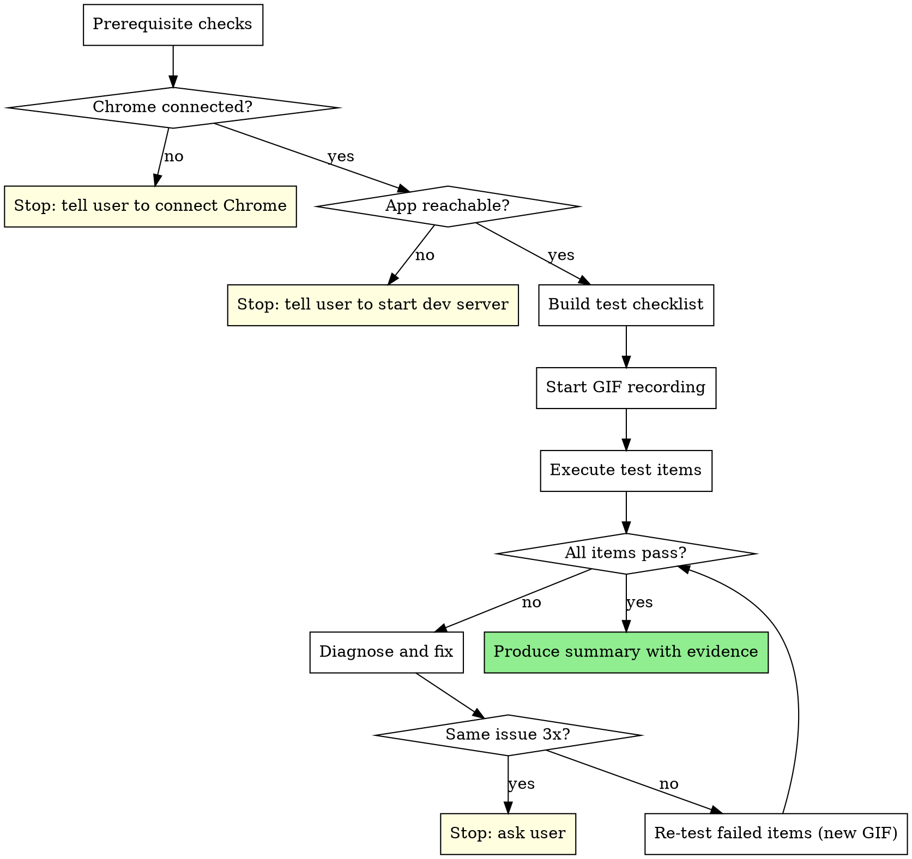

# Browser E2E Testing Skill Implementation Plan

> **For agentic workers:** REQUIRED SUB-SKILL: Use superpowers:subagent-driven-development (recommended) or superpowers:executing-plans to implement this plan task-by-task. Steps use checkbox (`- [ ]`) syntax for tracking.

**Goal:** Create a dedicated `browser-e2e-testing` skill that formalizes browser-based end-to-end verification for web app projects, and update three existing skills to reference it.

**Architecture:** Single self-contained SKILL.md following the standard skill structure. Three existing skills get their inline browser testing instructions replaced with a reference to the new skill.

**Tech Stack:** Markdown (skill authoring), Claude in Chrome MCP tools (runtime)

---

## File Structure

| Action | File | Responsibility |
|--------|------|----------------|
| Create | `skills/browser-e2e-testing/SKILL.md` | The new browser e2e testing skill |
| Modify | `skills/subagent-driven-development/SKILL.md` | Replace inline browser testing with skill reference |
| Modify | `skills/executing-plans/SKILL.md` | Replace inline browser testing with skill reference |
| Modify | `skills/verification-before-completion/SKILL.md` | Update browser test row to reference skill |

---

### Task 1: Create the browser-e2e-testing SKILL.md

**Files:**
- Create: `skills/browser-e2e-testing/SKILL.md`

- [ ] **Step 1: Create the skill directory and SKILL.md**

Create `skills/browser-e2e-testing/SKILL.md` with the following content:

```markdown
---
name: browser-e2e-testing
description: Use when implementation is complete and ready for final browser verification — after code review passes, before finishing the development branch; applies to web app projects with UI that can be tested in Chrome
---

# Browser E2E Testing

Verify the implementation works in a real browser before finishing the branch. Evidence before claims — if you can't show a screenshot, it hasn't been verified.

**Announce at start:** "I'm using the browser-e2e-testing skill to verify the implementation in Chrome."

## When to Use

- After all tasks complete and final code review passes
- Project has a web UI (React, Next.js, Svelte, Vue, plain HTML, etc.)
- Dev server is already running and accessible

**Skip only for:** Pure backend/utility/library work with zero UI impact.

## The Process



### Step 1: Prerequisite Checks

1. **Chrome connected** — call `tabs_context_mcp`. If error: stop, tell user to connect Chrome (`claude --chrome` or `/chrome`).
2. **App reachable** — navigate to the app URL (from spec, plan, or open Chrome tab). If page doesn't load: stop, tell user to start dev server.

No silent skipping. If either fails, stop with a clear message.

### Step 2: Build Test Checklist

Look for an explicit e2e test checklist in the spec or plan. If none, derive one by reading the plan/spec and identifying:

- Page loads and initial render
- Form submissions
- Navigation between pages/views
- Interactive elements (buttons, toggles, modals)
- Error states mentioned in the spec

Each item: concrete action + expected result.
Example: "Navigate to /todos → page loads with empty list"

### Step 3: Start GIF Recording

Start recording with `gif_creator`. Name: `e2e-test-run-1.gif`. Capture extra frames before and after actions.

### Step 4: Execute Each Test Item

For each checklist item:

1. **Navigate** to the relevant page
2. **Interact** — click, type, submit
3. **Read page** to verify expected result
4. **Check console** via `read_console_messages` for errors/warnings
5. **Screenshot** the resulting state

### Step 5: Assess and Fix

Categorize each item as **Pass** or **Fail**.

If failures exist:
1. Diagnose root cause (read code, check console)
2. Fix the code
3. New GIF recording (`e2e-test-run-2.gif`, etc.)
4. Re-run ONLY failed items
5. Fresh screenshots for re-tested items

Loop until all pass. If same issue persists after 3 fix attempts, stop and ask user.

### Step 6: Summary Report

```
## Browser E2E Test Results

Checklist: N/N passed (M fixed during testing)
Test runs: R

| # | Test Item              | Result | Notes              |
|---|------------------------|--------|--------------------|
| 1 | Homepage loads         | Pass   |                    |
| 2 | Form submits           | Pass   | Fixed: missing handler |

Evidence: e2e-test-run-1.gif, screenshot-1.png, ...
Console errors: None (after fixes)
```

## Red Flags — STOP

| Thought | Reality |
|---------|---------|
| "Code looks correct, skip browser" | Code correctness ≠ UI correctness. Test it. |
| "Unit tests pass" | Unit tests don't catch rendering or interaction bugs. |
| "Minor CSS change" | Minor CSS breaks layouts. Especially test those. |
| "Dev server isn't running, skip" | Stop. Tell user to start it. Don't skip. |
| "Tested one page, rest is fine" | Run every checklist item. No sampling. |
| "Fix is obvious, skip re-test" | Re-test after every fix. No exceptions. |
| "Screenshots enough, skip GIF" | Capture both. GIFs show flow screenshots miss. |
| "Console clean, skip visual check" | Console silence ≠ correct UI. Look at the page. |

## Integration

Invoked by:
- **superpowers:subagent-driven-development** — after final code review
- **superpowers:executing-plans** — after all tasks complete

Followed by:
- **superpowers:finishing-a-development-branch**
```

- [ ] **Step 2: Verify the file was created correctly**

Run: `wc -w skills/browser-e2e-testing/SKILL.md`
Expected: Under 500 words

- [ ] **Step 3: Commit**

```bash
git add skills/browser-e2e-testing/SKILL.md
git commit -m "feat: add browser-e2e-testing skill"
```

---

### Task 2: Update subagent-driven-development to reference the new skill

**Files:**
- Modify: `skills/subagent-driven-development/SKILL.md:64,86,206-237`

- [ ] **Step 1: Replace the browser testing node in the flowchart**

In `skills/subagent-driven-development/SKILL.md`, replace line 64:

```markdown
    "Browser test via Claude in Chrome" [shape=box style=filled fillcolor=lightyellow];
```

with:

```markdown
    "Use superpowers:browser-e2e-testing" [shape=box style=filled fillcolor=lightyellow];
```

- [ ] **Step 2: Update flowchart edges referencing the old node**

Replace all references to `"Browser test via Claude in Chrome"` in the flowchart edges (lines 86-89) with `"Use superpowers:browser-e2e-testing"`:

Line 86:
```markdown
    "Dispatch final code reviewer subagent for entire implementation" -> "Use superpowers:browser-e2e-testing";
```

Line 87:
```markdown
    "Use superpowers:browser-e2e-testing" -> "Browser issues found?";
```

Line 89:
```markdown
    "Fix browser issues" -> "Use superpowers:browser-e2e-testing" [label="re-test"];
```

- [ ] **Step 3: Replace the inline Browser Testing section**

Replace the entire "Browser Testing (after final code review)" section (lines 216-237) with:

```markdown
## Browser Testing (after final code review)

**REQUIRED SUB-SKILL:** Use superpowers:browser-e2e-testing

After the final code review passes and before finishing the branch, invoke the browser-e2e-testing skill to verify the implementation in a real browser.

**When to run:** Always for tasks that produce visible UI changes. Skip only for pure backend/utility work with no UI impact.

**If Chrome not connected:** Report that browser testing was skipped and why. Do not silently skip.
```

- [ ] **Step 4: Update the example workflow section**

Replace lines 206-213 in the example workflow:

```
[Browser test via Claude in Chrome]
  - Navigate to relevant page
  - Verify UI renders correctly
  - Test key user interactions (click, fill, navigate)
  - Check console for errors
Browser test: ✅ No issues found
```

with:

```
[Use superpowers:browser-e2e-testing]
Browser e2e test: ✅ 5/5 items passed, evidence captured
```

- [ ] **Step 5: Update the Integration section**

In the Integration section at the bottom of the file, add `browser-e2e-testing` to the required workflow skills list. After the line referencing `superpowers:requesting-code-review` (line 307), add:

```markdown
- **superpowers:browser-e2e-testing** - Browser verification before finishing branch
```

- [ ] **Step 6: Verify the file parses correctly**

Run: `head -5 skills/subagent-driven-development/SKILL.md`
Expected: YAML frontmatter intact

- [ ] **Step 7: Commit**

```bash
git add skills/subagent-driven-development/SKILL.md
git commit -m "refactor: replace inline browser testing with browser-e2e-testing skill reference"
```

---

### Task 3: Update executing-plans to reference the new skill

**Files:**
- Modify: `skills/executing-plans/SKILL.md:32-43`

- [ ] **Step 1: Replace the inline Browser Testing step**

Replace the entire "Step 3: Browser Testing" section (lines 32-43) with:

```markdown
### Step 3: Browser Testing

**REQUIRED SUB-SKILL:** Use superpowers:browser-e2e-testing

After all tasks complete, invoke the browser-e2e-testing skill to verify UI changes in a real browser.

Skip only for pure backend/utility work with zero UI impact.
```

- [ ] **Step 2: Update the Integration section**

Add `browser-e2e-testing` to the required workflow skills. After the line referencing `superpowers:writing-plans` (line 82), add:

```markdown
- **superpowers:browser-e2e-testing** - Browser verification before finishing branch
```

- [ ] **Step 3: Verify the file parses correctly**

Run: `head -5 skills/executing-plans/SKILL.md`
Expected: YAML frontmatter intact

- [ ] **Step 4: Commit**

```bash
git add skills/executing-plans/SKILL.md
git commit -m "refactor: replace inline browser testing with browser-e2e-testing skill reference"
```

---

### Task 4: Update verification-before-completion to reference the new skill

**Files:**
- Modify: `skills/verification-before-completion/SKILL.md:50,109-115`

- [ ] **Step 1: Update the Common Failures table row**

In the "Common Failures" table (line 50), replace:

```markdown
| UI works | Browser test via Claude in Chrome: navigate, interact, check console | "Code looks correct", no browser evidence |
```

with:

```markdown
| UI works | **REQUIRED SUB-SKILL:** superpowers:browser-e2e-testing | "Code looks correct", no browser evidence |
```

- [ ] **Step 2: Update the Browser verification pattern section**

Replace lines 109-115:

```markdown
**Browser (UI changes):**
```
✅ Navigate → Interact → Check console → Capture evidence → "UI verified"
❌ "Code looks correct" / "Should render properly"
```
Use Claude in Chrome extension (`claude-in-chrome` MCP tools). Launch with `claude --chrome` or `/chrome`.
Skip only for pure backend/utility work with zero UI impact.
```

with:

```markdown
**Browser (UI changes):**
```
✅ Use superpowers:browser-e2e-testing → checklist + evidence → "UI verified"
❌ "Code looks correct" / "Should render properly"
```
**REQUIRED SUB-SKILL:** Use superpowers:browser-e2e-testing for full browser verification.
Skip only for pure backend/utility work with zero UI impact.
```

- [ ] **Step 3: Verify the file parses correctly**

Run: `head -5 skills/verification-before-completion/SKILL.md`
Expected: YAML frontmatter intact

- [ ] **Step 4: Commit**

```bash
git add skills/verification-before-completion/SKILL.md
git commit -m "refactor: replace inline browser testing with browser-e2e-testing skill reference"
```
