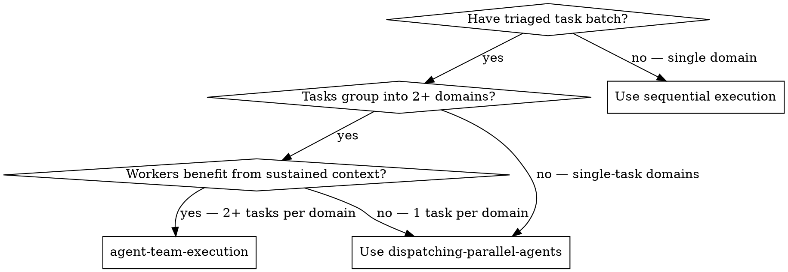
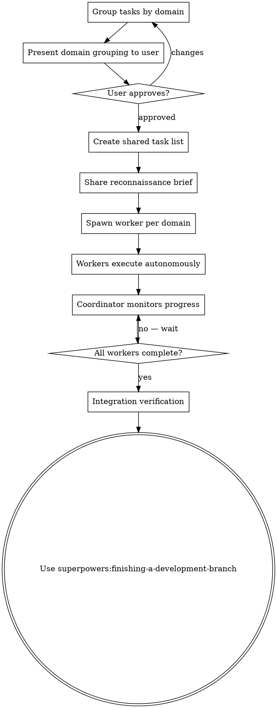

# Agent Team Execution

Spawn persistent worker teammates grouped by domain. Each worker owns a component area and works autonomously through all tasks in that area, building up deep context. The coordinator assigns domains, shares codebase understanding, and runs integration verification.

**Why persistent workers:** A fresh subagent per task starts from zero context every time. A persistent worker who handles all Details Drawer bugs reads the drawer code once and carries that understanding across bugs 2 and 3. The second fix is better because the worker already understands the component.

## When to Use



**Use when:**
- Tasks group naturally into 2-4 component/domain areas
- Each domain has 2+ tasks (workers benefit from accumulated context)
- Domains are independent (workers won't edit the same files)

**Don't use when:**
- All tasks touch the same files (merge conflict risk)
- Each domain has only 1 task (no benefit from persistence — use parallel subagents)
- Simple tasks that don't require deep codebase understanding

## Prerequisites

Agent Teams requires:
- Claude Code v2.1.32+
- `CLAUDE_CODE_EXPERIMENTAL_AGENT_TEAMS=1` in settings.json env
- Opus model (required for team coordination)

If Agent Teams is not available, fall back to task-batch-execution Phase 3 (sequential execution with the reconnaissance brief).

## The Process



## Step 1: Group Tasks by Domain

Using the triage table from task-batch-execution, group tasks by the component area or subsystem they touch:

```markdown
| Domain | Worker | Tasks | Files Owned |
|--------|--------|-------|-------------|
| Match Acquisitions Drawer | Worker 1 | #4, #5, #6 | ui/.../match-disposals-drawer/** |
| Details Drawer | Worker 2 | #2, #3 | ui/.../society-disposal-summary/**, app/...DisposalResource.php |
| Index / Grid | Worker 3 | #1, #7 | ui/.../society-disposals-list/**, app/...DisposalFilter.php |
```

**Grouping principles:**
- Group by shared component/file area — tasks that read the same code belong together
- Each domain must own distinct files — two workers editing the same file = data loss
- 2-4 workers is the sweet spot. More workers = more coordination overhead.
- Small tasks (capitalization fix) should go into the domain they belong to, not get their own worker

Present the domain grouping to the user for approval. The user may know that certain tasks are more related than they appear.

## Step 2: Create Shared Task List

Create tasks for each bug using TaskCreate with dependencies where applicable:

```
Task: [Domain] Bug #6 — Capitalize "selected" button
Task: [Domain] Bug #5 — Default tenure to disposal type
Task: [Domain] Bug #4 — Mark matched acquisitions as matched
```

Group tasks within a domain by size (small first) so workers build familiarity before tackling harder bugs.

Set dependencies if any exist (e.g., if bug #5 and #1 share filter code, the second should depend on the first).

## Step 3: Share Reconnaissance Brief

The codebase brief from task-batch-execution Phase 2 becomes shared context for all workers. Write it to a file the workers can reference:

Save the brief to `docs/superpowers/plans/codebase-brief.md` (or the project's preferred location). Each worker prompt should reference this file.

## Step 4: Spawn Workers

For each domain, spawn a persistent worker teammate:

```
Create an agent team to fix these bugs in parallel.

Spawn 3 teammates:

1. "match-drawer" — Fix bugs #4, #5, #6 in the Match Acquisitions Drawer.
   Read docs/superpowers/plans/codebase-brief.md for codebase context.
   Own files: ui/.../match-disposals-drawer/**
   Start with #6 (smallest), then #5, then #4.
   For each bug: understand the code, write a failing test, fix, verify, commit.

2. "details-drawer" — Fix bugs #2, #3 in the Details Drawer.
   Read docs/superpowers/plans/codebase-brief.md for codebase context.
   Own files: ui/.../society-disposal-summary/**, app/...DisposalResource.php
   Bug #2 requires backend changes. Bug #3 may need API response changes.
   For each bug: understand the code, write a failing test, fix, verify, commit.

3. "index-grid" — Fix bugs #1, #7 on the Index page.
   Read docs/superpowers/plans/codebase-brief.md for codebase context.
   Own files: ui/.../society-disposals-list/**, app/...DisposalFilter.php
   Bug #1 requires full-stack investigation (BE filter + FE mapping).
   For each bug: understand the code, write a failing test, fix, verify, commit.

Require plan approval before any teammate makes changes.
```

**Key instructions for each worker:**
- Read the codebase brief first
- Work through tasks in order (small → large)
- For each task: understand → test → fix → **browser-verify** → commit
- **Browser-verify every UI-facing fix before committing.** Use superpowers:browser-e2e-testing to open the affected page and confirm the bug symptom is gone and the expected behavior works. Screenshots as evidence. No "looks right from reading the code" — actual browser interaction.
- Mark tasks complete via TaskUpdate when done
- If blocked, message the coordinator with specifics
- Do NOT edit files outside your owned area
- Do NOT mark a task complete if browser verification was skipped

**Plan approval is critical.** Each worker should present their understanding and approach before implementing. This catches misunderstandings before they become wrong code.

**Browser verification is non-negotiable for UI fixes.** A "fix" that compiles and passes unit tests but breaks the actual user interaction is not a fix. Workers must open the browser, reproduce the original bug to confirm the symptom, apply the fix, and confirm the symptom is gone. Screenshot evidence required.

## Step 5: Coordinator Responsibilities

While workers execute, the coordinator (you / the lead session):

**Monitor progress:**
- Use `Shift+Down` to cycle through workers and check their progress
- Check task list with `Ctrl+T` for completion status
- Review each worker's plan approval request carefully

**Intervene when needed:**
- If a worker is stuck, provide additional context or redirect their approach
- If a worker's plan shows a misunderstanding of the code, reject with specific correction
- If two workers discover they need to touch the same file, coordinate the order

**Do NOT:**
- Implement bugs yourself while workers are running (file conflicts)
- Let workers run unattended for long periods
- Skip reviewing plan approvals

## Step 6: Integration Verification

After all workers complete their tasks:

1. **Check for conflicts:** Review all commits across workers. Any unexpected file overlaps?
2. **Run full test suite:** All tests should pass with all changes combined.
3. **Cross-domain verification:** Does the filter fix (Worker 3) affect the match drawer's filter defaults (Worker 1)? Test combinations.
4. **Browser verification:** **REQUIRED SUB-SKILL:** Use superpowers:browser-e2e-testing to verify all fixes in a real browser.
5. **REQUIRED SUB-SKILL:** Use superpowers:finishing-a-development-branch

## Example: Migration Bug Batch

Starting from the migration.md triage:

```
Coordinator: "Triaged 7 bugs into 3 domains. Spawning team."

Worker 1 (match-drawer):
  → Reads brief, understands MatchDisposalsDrawer component
  → Bug #6: Finds t('selected_1'), changes to t('selected'). Commits.
  → Bug #5: Reads tenure initialization, sees hardcoded 'for_sale'.
    Understands data.for_sale/data.to_let flags. Fixes default. Commits.
  → Bug #4: Reads existing_match logic. Traces state after match submission.
    Discovers local state isn't updated after API call. Adds optimistic update. Commits.
  → All 3 bugs fixed. Context from #6 and #5 informed #4's investigation.

Worker 2 (details-drawer):
  → Reads brief, understands disposal summary + API resources
  → Bug #2: Checks V2 SocietyDisposalResource. Tenancy fields missing.
    Adds tenancy section to API response. Updates FE types. Commits.
  → Bug #3: Reads joint_agent_logos. Traces Angular switchDisposal behavior.
    Discovers joint_agent_adverts needed in V2 response. Adds to API + FE. Commits.
  → Both bugs fixed. Understanding of V2 resource from #2 directly helped #3.

Worker 3 (index-grid):
  → Reads brief, understands disposal list + filters + grid
  → Bug #7: Compares with /disposals/all page. Finds pagination component.
    Adds to grid view branch. Commits.
  → Bug #1: Traces filter → API → query. Discovers saleTypes() filter
    doesn't handle numeric values correctly. Fixes BE filter. Commits.
  → Both bugs fixed.

Coordinator:
  → Reviews all commits. No file conflicts.
  → Runs test suite. All pass.
  → Browser tests: All 7 fixes verified visually.
  → Finishes branch.
```

**Total workers: 3 (not 21+ subagent invocations)**
**Each worker builds domain expertise across their assigned bugs.**

## When Agent Teams Is Not Available

If the experimental flag is not set or Opus is not available:

Fall back to **task-batch-execution Phase 3** (sequential execution) with one key adaptation: execute all tasks within a domain group together before moving to the next domain. This preserves the benefit of domain context accumulation even without persistent workers.

```
Domain 1 (Match Acquisitions): Fix #6 → #5 → #4 (build context within domain)
Domain 2 (Details Drawer): Fix #2 → #3 (build context within domain)
Domain 3 (Index/Grid): Fix #7 → #1 (build context within domain)
```

This is sequential but preserves the grouping benefit — you understand the Match Acquisitions Drawer deeply before moving on, rather than jumping between components.

## Red Flags

| Thought | Reality |
|---------|---------|
| "Each bug should get its own worker" | Workers per task = subagents with extra overhead. Group by domain. |
| "I'll let workers run without reviewing plans" | Plan approval catches misunderstandings before they become wrong code. |
| "Workers can share files" | Two workers editing the same file = overwrites and data loss. Strict file ownership. |
| "I don't need the reconnaissance brief" | Workers start from zero context. The brief is their foundation. Skip it and they waste time re-exploring. |
| "5+ workers will be faster" | Coordination overhead grows with team size. 2-4 workers is the sweet spot. |
| "Workers will figure out dependencies" | The coordinator must identify cross-domain dependencies upfront. Workers can't see each other's code. |

## Integration

**Invoked from:** superpowers:task-batch-execution (as Phase 3/4 alternative)
**Uses:** superpowers:codebase-reconnaissance (brief as shared context), superpowers:browser-e2e-testing, superpowers:finishing-a-development-branch
**Requires:** Claude Code Agent Teams (experimental), Opus model
**Falls back to:** Sequential domain-grouped execution
