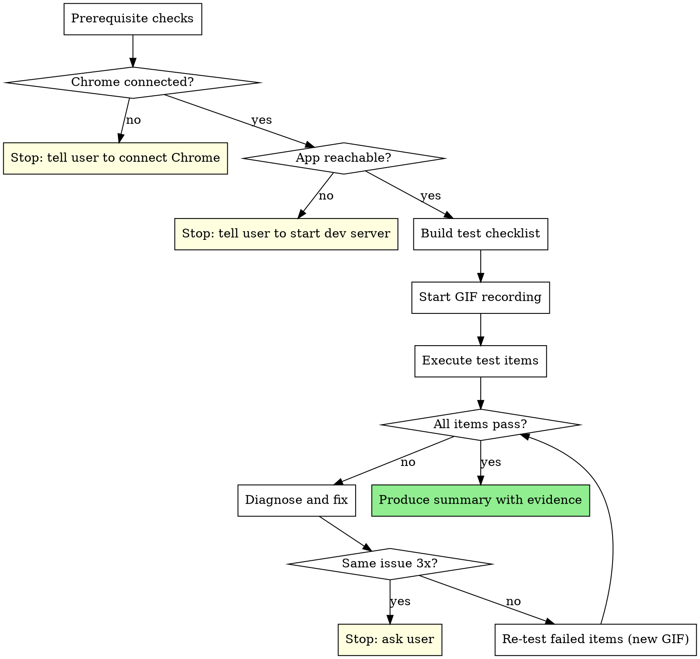

# Browser E2E Testing

Verify the implementation works in a real browser before finishing the branch. Evidence before claims — if you can't show a screenshot, it hasn't been verified.

**Announce at start:** "I'm using the browser-e2e-testing skill to verify the implementation in Chrome."

## When to Use

- After all tasks complete and final code review passes
- Project has a web UI (React, Next.js, Svelte, Vue, plain HTML, etc.)
- Dev server is already running and accessible

**Skip only for:** Pure backend/utility/library work with zero UI impact.

## The Process



### Step 1: Prerequisite Checks

1. **Chrome connected** — call `tabs_context_mcp`. If error: stop, tell user to connect Chrome (`claude --chrome` or `/chrome`).
2. **App reachable** — navigate to the app URL (from spec, plan, or open Chrome tab). If page doesn't load: stop, tell user to start dev server.

No silent skipping. If either fails, stop with a clear message.

### Step 2: Build Test Checklist

Look for an explicit e2e test checklist in the spec or plan. If none, derive one by reading the plan/spec and identifying:

- Page loads and initial render
- Form submissions
- Navigation between pages/views
- Interactive elements (buttons, toggles, modals)
- Error states mentioned in the spec

Each item: concrete action + expected result.
Example: "Navigate to /todos → page loads with empty list"

### Step 3: Start GIF Recording

Start recording with `gif_creator`. Name: `e2e-test-run-1.gif`. Capture extra frames before and after actions.

### Step 4: Execute Each Test Item

For each checklist item:

1. **Navigate** to the relevant page
2. **Interact** — click, type, submit
3. **Read page** to verify expected result
4. **Check console** via `read_console_messages` for errors/warnings
5. **Screenshot** the resulting state

### Step 5: Assess and Fix

Categorize each item as **Pass** or **Fail**.

If failures exist:
1. Diagnose root cause (read code, check console)
2. Fix the code
3. New GIF recording (`e2e-test-run-2.gif`, etc.)
4. Re-run ONLY failed items
5. Fresh screenshots for re-tested items

Loop until all pass. If same issue persists after 3 fix attempts, stop and ask user.

### Step 6: Summary Report

```
## Browser E2E Test Results

Checklist: N/N passed (M fixed during testing)
Test runs: R

| # | Test Item              | Result | Notes              |
|---|------------------------|--------|--------------------|
| 1 | Homepage loads         | Pass   |                    |
| 2 | Form submits           | Pass   | Fixed: missing handler |

Evidence: e2e-test-run-1.gif, screenshot-1.png, ...
Console errors: None (after fixes)
```

## Red Flags — STOP

| Thought | Reality |
|---------|---------|
| "Code looks correct, skip browser" | Code correctness ≠ UI correctness. Test it. |
| "Unit tests pass" | Unit tests don't catch rendering or interaction bugs. |
| "Minor CSS change" | Minor CSS breaks layouts. Especially test those. |
| "Dev server isn't running, skip" | Stop. Tell user to start it. Don't skip. |
| "Tested one page, rest is fine" | Run every checklist item. No sampling. |
| "Fix is obvious, skip re-test" | Re-test after every fix. No exceptions. |
| "Screenshots enough, skip GIF" | Capture both. GIFs show flow screenshots miss. |
| "Console clean, skip visual check" | Console silence ≠ correct UI. Look at the page. |

## Integration

Invoked by:
- **superpowers:subagent-driven-development** — after final code review
- **superpowers:executing-plans** — after all tasks complete

Followed by:
- **superpowers:finishing-a-development-branch**
