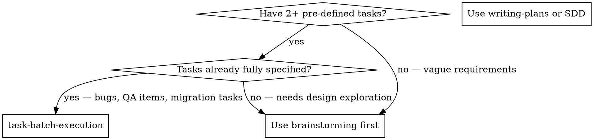
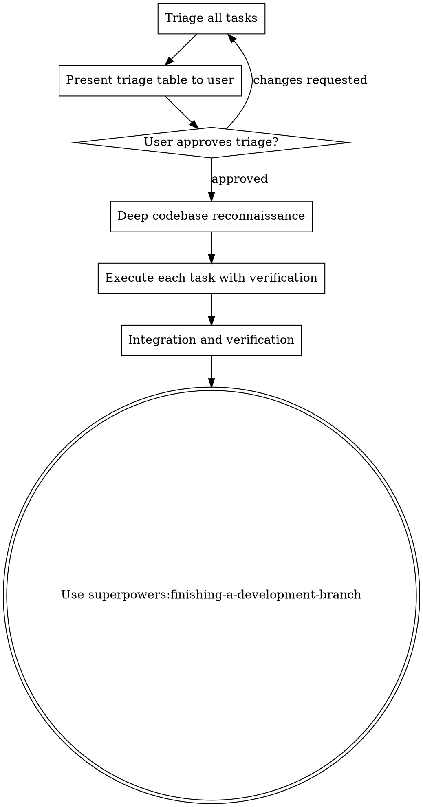

# Task Batch Execution

Execute a list of pre-defined tasks correctly by triaging, building deep codebase understanding, and verifying each fix before moving on. Not every bug needs a design doc, but every bug needs to be fixed correctly.

<HARD-GATE>
Do NOT start fixing bugs before completing triage and reconnaissance. The first fix attempt without understanding the codebase is almost always wrong. Invest in understanding first — correct fixes come from deep understanding, not fast iteration.
</HARD-GATE>

## When to Use



**Use for:** Bug batches, QA reports, migration checklists, tech debt items, defined feature punch lists
**Don't use for:** Vague feature requests, open-ended projects, single bugs (use systematic-debugging)

## The Process



## Phase 1: Triage

For each task, assess three things and build a triage table:

**Complexity tier:**
- **Small** — Cosmetic, config, typo, capitalization, single clear change. But still needs verification.
- **Medium** — Logic bug, data binding, missing component, state propagation. Requires reading code and understanding data flow.
- **Large** — Multi-component interaction, architectural issue, business logic with many edge cases, requires backend investigation.

**Independence:**
- Does this task share files or state with other tasks?
- Group dependent tasks together (e.g., two bugs in the same filter component).

**Information needs:**
- What do you need to understand in the codebase to fix this correctly?

**Present the triage table to the user:**

```markdown
| # | Task                              | Size   | Independent? | What Needs Understanding               |
|---|-----------------------------------|--------|-------------|----------------------------------------|
| 6 | Capitalize button text            | Small  | Yes         | Find the component, check i18n pattern |
| 7 | Add pagination to grid            | Medium | Yes         | How pagination works on similar pages  |
| 1 | Filter showing wrong results      | Medium | Yes         | Filter → API → response mapping        |
| 5 | Filter default value wrong        | Medium | ~1          | Filter initialization + disposal types |
| 2 | Tenancy data not loading          | Large  | Yes         | BE response shape + FE data binding    |
| 3 | Dropdown not updating state       | Medium | Yes         | Selection → state update → re-render   |
| 4 | Matched items not tracked         | Large  | Yes         | Match state management + persistence   |
```

**Order by size** (small first). Quick wins build codebase familiarity for harder tasks.

Present the triage table even when all tasks fall in the same size. The table communicates your execution plan, independence groupings, and task order. The user may have context that changes your triage ("that one is blocked on a deploy" or "skip that, it's already fixed").

Wait for user approval before proceeding.

## Phase 2: Deep Codebase Reconnaissance

**SUB-SKILL:** Use superpowers:codebase-reconnaissance

If you already have session context from prior work in this codebase, abbreviate to mapping tasks to known files (Steps 3 and 4 only). The brief artifact is still required.

Build **deep** understanding of the codebase scoped to the batch. Do this ONCE for all tasks, not per-task. The reconnaissance output becomes shared context for all subsequent work.

The reconnaissance should produce:
- Project structure and key technologies
- State management pattern and data flow
- How to run tests and verify changes
- Relevant file paths mapped to each task from the triage table
- **For each task:** How the relevant code currently works and what the likely root cause is

**Invest time here.** The difference between a correct fix and a wrong fix is almost always understanding. Read the actual code, trace the data flows, understand cause and effect.

**STOP if reconnaissance finds nothing:** If you cannot find files relevant to the tasks (components, controllers, modules referenced in the bug descriptions don't exist in this codebase), STOP and tell the user. The most likely cause is running in the wrong directory. Do NOT proceed to implementation with no matching code — you will hallucinate fixes.

## Phase 3: Choose Execution Strategy

<HARD-GATE>
Before executing ANY task, you MUST explicitly evaluate the grouping criterion and announce your choice. Do NOT default to sequential execution — that is the failure mode this skill exists to prevent.
</HARD-GATE>

### Step 3a: Evaluate Grouping (REQUIRED)

Count the domains from your triage table. A "domain" is a distinct component/subsystem area where 2+ tasks share files or concepts.

Answer these questions out loud to the user:

1. **How many domains have 2+ tasks?** (count them from the triage table)
2. **Are the domains file-independent?** (no shared files between domains)
3. **Is Agent Teams enabled?** (run `echo $CLAUDE_CODE_EXPERIMENTAL_AGENT_TEAMS` — must be "1")

### Step 3b: Declare Execution Strategy (REQUIRED)

Based on your evaluation, state ONE of these three strings verbatim:

**Option A — Agent Teams:**
> "2+ domains have 2+ tasks each and are file-independent. Invoking superpowers:agent-team-execution."

Then **INVOKE superpowers:agent-team-execution**. Do NOT proceed to Sequential Execution below.

**Option B — Sequential (single domain):**
> "Only 1 domain has 2+ tasks. Executing sequentially in the current session."

Then proceed to Sequential Execution below.

**Option C — Sequential (fallback):**
> "Agent Teams is not enabled (CLAUDE_CODE_EXPERIMENTAL_AGENT_TEAMS not set). Falling back to domain-grouped sequential execution."

Then proceed to Sequential Execution below.

**You MUST pick exactly one.** If you find yourself writing "I'll just execute sequentially" without declaring one of these three options, STOP — you're skipping the required evaluation.

### Red Flags at Phase 3

| Thought | Reality |
|---------|---------|
| "Sequential is simpler, let me just do that" | The whole point is to detect when agent teams would help. Evaluate the criterion. |
| "I'll figure out which path as I go" | Declare upfront. Mid-execution pivots waste context. |
| "The tasks are independent enough for sequential" | If 2+ domains have 2+ tasks AND the flag is set, agent teams wins. Don't rationalize. |
| "Agent teams is too heavy for this" | You haven't tested it yet. Let the skill decide — it has its own fallback logic. |

## Sequential Execution

Every task — regardless of size — gets the same core cycle: **understand → fix → verify → review**.

### For Each Task:

1. **Understand** — Read the relevant files identified in reconnaissance. For Medium/Large tasks, trace the full data flow. Form a clear hypothesis about the root cause.

2. **Test first** — Write a failing test that reproduces the bug (when testable). This proves you understand the bug and gives you a verification mechanism.

3. **Implement the fix** — Make the minimal correct change. Don't over-engineer, but don't cut corners.

4. **Verify** — Run the test suite. **For UI changes, you MUST verify in the browser using superpowers:browser-e2e-testing — open the page, reproduce the original symptom to confirm you're testing the right thing, apply the fix, confirm the symptom is gone. Screenshot evidence required. "Looks right from reading the code" is not verification.** For API issues, check the actual response. **Do not move to the next task until the current fix is browser-verified.**

5. **Review** — For Small tasks: self-review the diff for unintended changes. For Medium/Large tasks: dispatch a code quality reviewer subagent to check the fix.

6. **Commit** — One commit per task with a clear message describing what was fixed and why.

### Tier Escalation

If execution reveals a task is more complex than its triage size, escalate immediately. A "Small" task that turns out to involve a localization system becomes Medium. Briefly note the escalation to the user. Triage errors should always escalate, never de-escalate.

If reconnaissance reveals a critical pattern that affects multiple tasks, pause to update the brief before continuing.

## Phase 4: Parallel Dispatch

If triage identified independent tasks and the environment supports it:

**Small tasks:** Execute directly in the current session — they're fast but still need verification.

**Medium/Large tasks:** Dispatch 2-3 independent tasks in parallel using subagents with worktree isolation. Each subagent gets:
- Its specific task description
- The **full codebase reconnaissance brief** from Phase 2
- Clear instructions to understand → test → fix → verify
- The relevant file paths and root cause hypothesis

**If all tasks share the same component:** Execute sequentially within the shared component, ordered by size (Small first). Shared-component batches benefit MORE from reconnaissance because understanding the component once informs every fix.

**If parallel dispatch is not available** (no subagent support, no worktrees, or tasks not independent enough): Execute sequentially. Do NOT attempt parallel execution without proper isolation.

**SUB-SKILL (for parallel dispatch):** Use superpowers:dispatching-parallel-agents

## Phase 5: Integration and Verification

After all tasks are complete:

1. Run the full test suite — no regressions
2. Verify each fix against its original task description
3. For UI-facing fixes: **REQUIRED SUB-SKILL:** Use superpowers:browser-e2e-testing
4. **REQUIRED SUB-SKILL:** Use superpowers:finishing-a-development-branch

## Red Flags

| Thought | Reality |
|---------|---------|
| "Let me brainstorm this bug batch" | Pre-defined bugs don't need design exploration. Triage and execute. |
| "I should write a design doc for each bug" | The bug report IS the spec. Invest in understanding the code, not writing docs. |
| "I'll work them in listed order" | Triage by size first. Quick wins build codebase familiarity. |
| "I'll figure out the codebase as I go" | Do reconnaissance once, share it across tasks. Don't re-explore for each bug. |
| "I should explore before triaging" | Triage is based on the task descriptions, not the code. Explore after. |
| "Let me do all 7 sequentially" | Independent tasks can be parallelized. Group dependent ones. |
| "This is a small fix, I don't need to verify" | Every fix needs verification. Small fixes in unfamiliar code still break things. |
| "I understand enough to fix this" | If you can't explain the data flow, you don't understand enough. Read more code. |

## Integration

**Routed from:** superpowers:work-intake
**Uses:** superpowers:codebase-reconnaissance, superpowers:systematic-debugging, superpowers:dispatching-parallel-agents, superpowers:test-driven-development, superpowers:browser-e2e-testing, superpowers:finishing-a-development-branch
