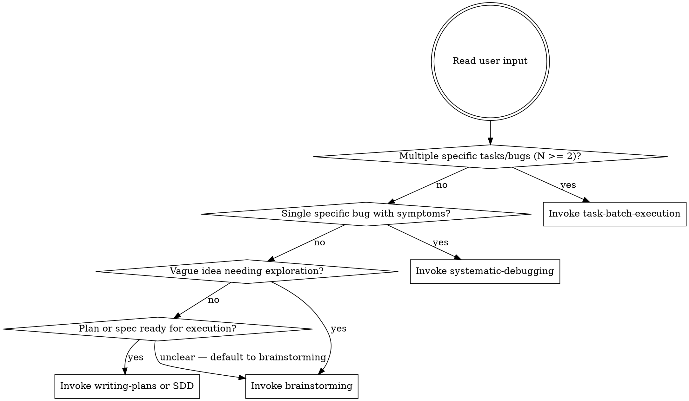

# Work Intake

Classify what kind of work the user is asking for and route to the right workflow. This is a 30-second decision, not a 30-minute process.

<HARD-GATE>
Do NOT explore the codebase, do NOT ask clarifying questions, do NOT start fixing anything. Classify the input shape FIRST, present your classification, then invoke the correct skill.
</HARD-GATE>

## Why This Exists

Without routing, agents either (a) funnel everything through brainstorming's 9-step design process — even for pre-defined bugs — or (b) skip all structure and dive into code. Both waste tokens. A "capitalize this button" fix does not need a design doc. A list of 7 independent bugs does not need to be explored one at a time.

## Checklist

1. **Read the user's input** and classify it using the flowchart below
2. **Present classification** to user in one sentence (e.g., "This looks like a batch of 7 independent bug fixes. I'll triage and execute them efficiently.")
3. **Invoke the routed skill** immediately

## Classification

## Detection Heuristics

**Task batch** (route to task-batch-execution):
- Input contains a numbered or bulleted list of independently actionable items
- Items describe bugs, fixes, or changes with specific symptoms or locations
- Items span different components, pages, or subsystems
- Input references an external document (migration doc, QA report, ticket list)

**Single bug** (route to systematic-debugging):
- One specific problem with observable symptoms
- User describes what's broken and what they expected
- Clear before/after behavior

**Greenfield idea** (route to brainstorming):
- User describes what they want to build, not what's broken
- Requirements are open-ended or underspecified
- Design decisions haven't been made yet

**Ready to execute** (route to writing-plans or subagent-driven-development):
- User has an existing spec or plan document
- Requirements are fully specified with file paths and acceptance criteria

## Anti-Pattern: "Let Me Explore First"

Do NOT read files, check git history, or investigate the codebase before classifying. Classification is based on the **shape of the user's input**, not on the codebase. You can classify "7 bugs from our React migration" without reading a single React file.

## Anti-Pattern: "This Is Creative Work, Use Brainstorming"

Bug fixing modifies behavior, but that does not make it creative work requiring design exploration. Pre-defined bugs with known symptoms need debugging and fixing, not brainstorming approaches. If the user gave you a list of things to fix, they already did the brainstorming.

## Mixed Input

If most items are actionable but 1-2 are vague or are feature requests rather than bugs, classify as a batch. During Phase 1 triage, mark vague items as "Needs clarification — ask user or defer" rather than splitting into parallel workflows. Do not run brainstorming and batch-execution simultaneously for parts of the same input.

## When This Skill Does NOT Apply

- User explicitly asks for design exploration ("help me think through the architecture...", "what approach should we take for...")
- User asks a question that doesn't involve code changes
- User is continuing work from a previous session with an existing plan

**Note on "brainstorm" as vocabulary:** If the user says "brainstorm these bugs" or "let me brainstorm through this list," they likely mean "work through" colloquially. Classify based on input shape, not vocabulary. Only bypass routing when the user is genuinely requesting open-ended design exploration, not using "brainstorm" as a synonym for "work on."
